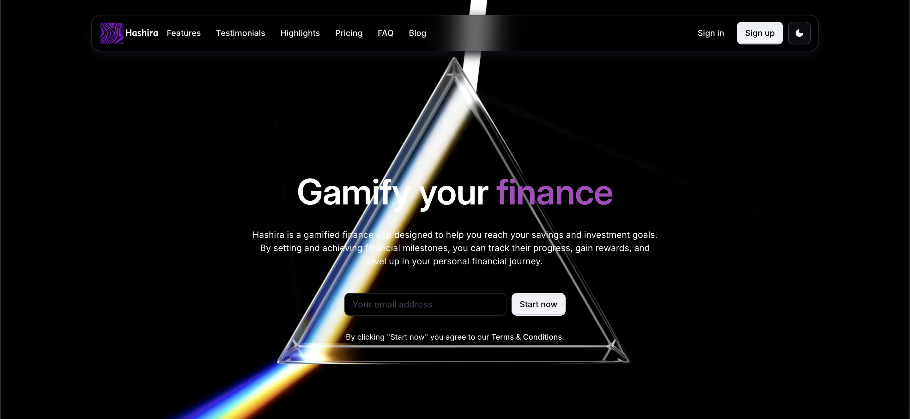

<!DOCTYPE html>
<html lang="en">
<head>
    <meta charset="UTF-8">
    <meta name="viewport" content="width=device-width, initial-scale=1.0">
</head>
<body>

<h1>Hashira - Gamified Finance App</h1>

<strong>Hashira</strong> is a gamified finance app designed to help users reach their savings and investment goals by evolving through the ranks, ultimately becoming a <strong>Finance Hashira</strong>. By setting and achieving financial milestones, users can track their progress, gain rewards, and level up in their personal financial journey.

<h2>🚀 Project Status</h2>

The app is currently in development. The <strong>frontend design</strong> is mostly complete, and the next steps include finishing the frontend design, adding login functionality, and building the web app.

<h3>Future Tasks:</h3>
<ul>
    <li>Finish the <strong>frontend design</strong> to ensure a polished user interface.</li>
    <li>Implement <strong>user login functionality</strong> for a personalized experience.</li>
    <li>Develop the <strong>backend</strong> (using Django) to handle user authentication, goal tracking, and other features.</li>
    <li>Build the full <strong>web app</strong> for a seamless user experience.</li>
</ul>

<h2>📊 Tech Stack</h2>
<ul>
    <li><strong>Frontend</strong>: React, MUI</li>
    <li><strong>Backend</strong>: Django</li>
    <li><strong>Authentication</strong>: (Coming soon) User login functionality</li>
    <li><strong>State Management</strong>: React Context or Redux (future implementation)</li>
    <li><strong>Database</strong>: (Coming soon) Django ORM (likely to store user data, financial goals, etc.)</li>
</ul>

<h2>🏆 Features</h2>
<ul>
    <li><strong>Rank Up</strong>: Set financial goals (such as saving or investing) and track your progress to level up.</li>
    <li><strong>Progress Tracking</strong>: View your progress towards goals and milestones to see how close you are to becoming a Finance Hashira.</li>
    <li><strong>Rewards System</strong>: Earn rewards and unlock achievements as you meet your financial goals.</li>
    <li><strong>Gamification</strong>: Make saving and investing fun with a unique gamified approach to personal finance.</li>
</ul>

<h2>🛠️ Installation</h2>

To get started with the development of Hashira, clone this repository and follow the steps below:

<h3>Prerequisites</h3>
<ul>
    <li>Node.js (for frontend development)</li>
    <li>Python (for backend development)</li>
    <li>Django (for backend development)</li>
</ul>

<h3>Frontend Setup (React)</h3>
<ol>
    <li>Clone the repository:
        <pre><code>git clone https://github.com/your-username/hashira.git</code></pre>
        <pre><code>cd hashira</code></pre>
    </li>
    <li>Install dependencies:
        <pre><code>npm install</code></pre>
    </li>
    <li>Start the development server:
        <pre><code>npm start</code></pre>
    </li>
</ol>

<h3>Backend Setup (Django)</h3>
<ol>
    <li>Navigate to the backend folder:
        <pre><code>cd backend</code></pre>
    </li>
    <li>Install Python dependencies:
        <pre><code>pip install -r requirements.txt</code></pre>
    </li>
    <li>Run migrations to set up the database:
        <pre><code>python manage.py migrate</code></pre>
    </li>
    <li>Start the Django development server:
        <pre><code>python manage.py runserver</code></pre>
    </li>
</ol>

<h2>🔧 Contributing</h2>

We welcome contributions! If you'd like to help improve Hashira, please fork the repository and create a pull request with your changes. You can also submit issues to track bugs or request new features.

<h3>How to contribute:</h3>
<ol>
    <li>Fork the repository</li>
    <li>Create a new branch (<code>git checkout -b feature-branch</code>)</li>
    <li>Make your changes</li>
    <li>Commit your changes (<code>git commit -m 'Add new feature'</code>)</li>
    <li>Push to your forked repository (<code>git push origin feature-branch</code>)</li>
    <li>Create a pull request</li>
</ol>

<h2>📧 Contact</h2>

For any questions or feedback, feel free to reach out to us at <a href="mailto:your-email@example.com">your-email@example.com</a>.

<h2>📝 License</h2>

This project is licensed under the MIT License - see the <a href="LICENSE">LICENSE</a> file for details.

</body>
</html>
